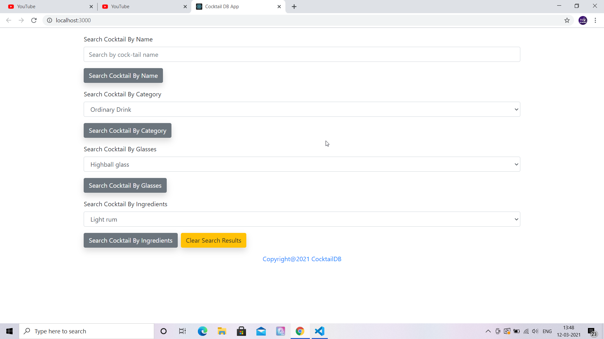
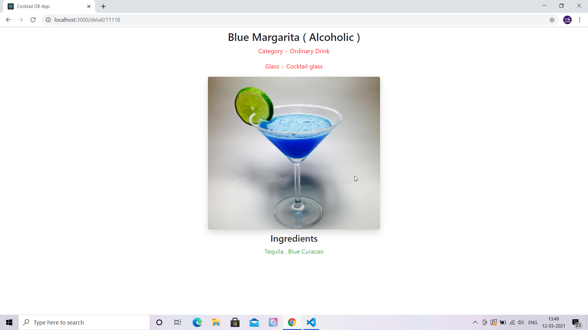
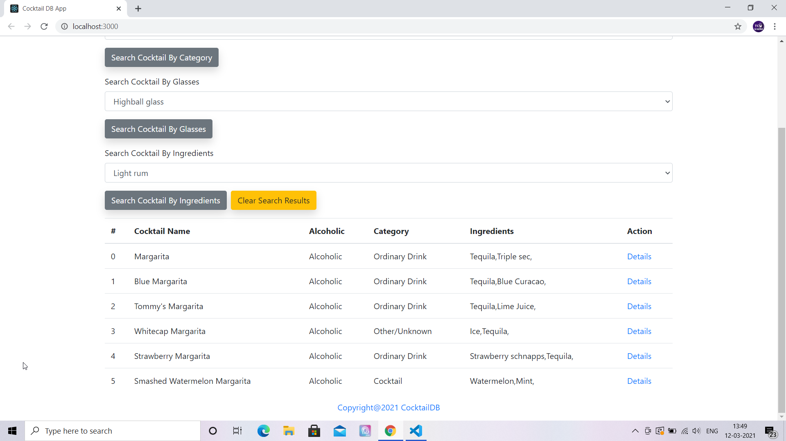
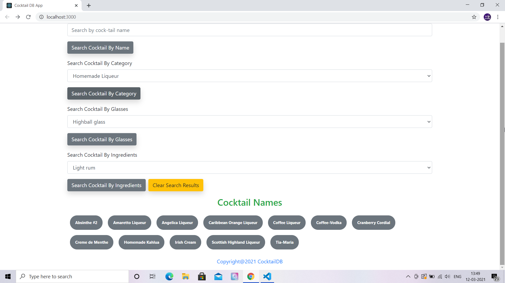

# Cocktails - Cocktail Database App in React

## Project Briefing

This is a cocktail database app created in React Js powered by bootstrap css framework. This app using data from the CocktailDb website and contains details about loads of cocktails across the globe. Please support them, in my knowledge it's one of the easiest APIs to use with no authentication. 

Using this app you would be able to search through the cocktail collection by name, you'd be able to filter them by whether they're alcoholic or not, filter by ingredients and more.

## Built With

* [React JS](https://reactjs.org/)
* [Bootstrap](https://getbootstrap.com/)

## Updates

- 23/3/23

Conversion into a Vite React project started. For this, package.json was first updated. Then, index.html file was copied from one of my other existing Vite React project inside the root folder.  

## Authors

* **Amit Prafulla (APFirebolt)** - (https://apgiiit.com/)
## Project setup
This should be a piece of cake for you if you have worked under npm environment before. Simply initialize an empty project using 'npm init' and then install packages or simply clone the project and install dependencies.
```
npm install
npm start
```
### Compiles and minifies for production
```
npm run build
```

## Updates

- 26-05-2022 : Minor changes in the UI
## Project Screenshots

Please find some of the screenshots of the application. First screenshot depicts the homepage of the application.



This shows Cock detail page which displays picture of the cocktail, name and ingredients used to make this variant.



This screenshot shows the list of cocktails fetched when searched by name for a cocktail.



This shows page where list of all Cocktail names when filtered through categories, ingredients and glass.

